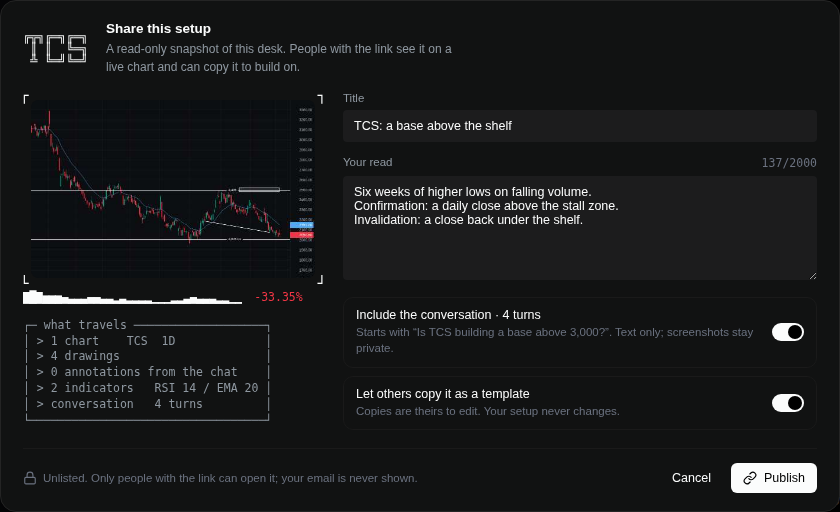
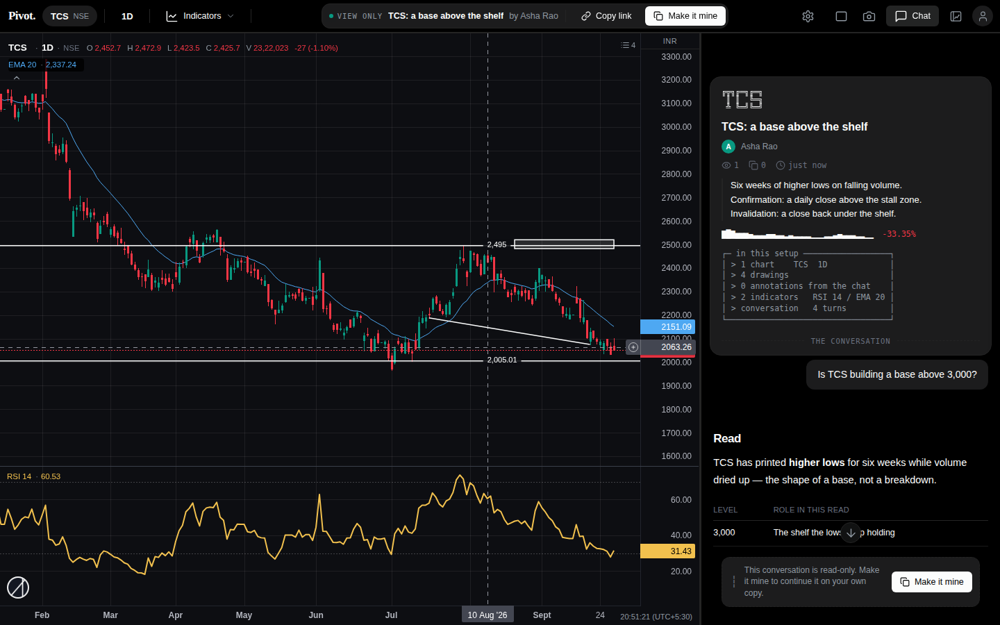

# Shared setups: publish a desk read-only; others copy it as a template

Branch `claude-cloud-29sep`. Chart app (charto) only: `charto/data` and
`charto/preview`. pivot and pivot-next are untouched.

## What it does

A trader clicks **Share** in the chart header. The desk they are looking at
is published as a frozen, read-only **setup** behind an unlisted link. A
setup contains:

- the pane grid, and each pane's symbol and interval;
- the drawings, and what the chat drew;
- the indicators and the volume profile;
- a title and the author's note;
- optionally, the conversation (text only).

Anyone with the link sees it on a live chart without signing in. The chat
panel becomes the setup's card plus its conversation, read-only.
**Make it mine** copies the setup into the reader's own layouts. The copy is
editable, has autosave on, carries the conversation, and credits its source
("built on … by …"). If the copy is published in turn, the credit chain
travels with it.

## Design decisions (researched)

- **Snapshot, not a live link.** TradingView ideas and Figma community files
  both freeze what was published. A read has to hold still to be worth
  reading. Re-publishing is deliberate: "Update the existing link" keeps the
  URL and the counters.
- **The copy is independent** (Figma's "Duplicate to your drafts"). Later
  re-publishes never reach it. Unpublishing kills the link, not the copies.
- **The author can switch copying off** (TradingView requires the author to
  allow "Make it mine"). The link then stays view-only.
- **Link safety:**
  - Tokens are 18 random bytes. Unpublishing deletes the row, so a dead
    link is dead.
  - Viewers get the author's display name, never their email or layout id.
  - The chat is shared only on opt-in, as text only. Screenshots, tool
    panels and context envelopes never leave the author's browser.

## Where it lives

| Piece | File |
|---|---|
| Data model, publish/view/copy/unpublish, scrubbing, counters | `charto/data/shares.py` (bound to dataserver's `_users` connection and lock, like entitlements) |
| Routes | `charto/data/dataserver.py`: `GET /setup?token=` and `GET /shared?token=` are public (setup first, then the old live layout link). `GET /setups` (mine, optional `?layout=`), `POST /setups` (publish, `{token}` to update, `{token, delete:true}` to unpublish) and `POST /setups/copy` need a session. |
| Tables | `shared_setups` and `setup_copies` in `charto_users.db`; `layouts.origin` (JSON credit chain) |
| UI | `charto/preview/js/setups.js` (Share dialog, My shared setups, view mode, Make it mine, ASCII kit) plus a CSS block `.su-*` in `index.html` |
| ASCII type | `charto/preview/vendor/figlet/` (figlet.js 1.12, MIT, with Calvin S patched to add digits; see its README) |
| Tests | `charto/data/test_shares.py` (10 unit tests); `charto/preview/e2e_shares.mjs` (browser, 13 checks) |

No nginx change is needed: every non-file path already falls through to the
dataserver (see the header of `deploy/nginx-charto.conf`).

## Isolation: a view cannot touch the reader's own work

The chart saves everything it shows into the viewer's storage. In a view
session (`?view=<token>`):

- **store.js** holds the desk's keys in memory only. Other preferences read
  through to the reader's settings but are never written.
- **drawings.js** neither loads nor saves the reader's shapes.
- **auth.js** workspace sync is a no-op.
- **layouts.js** adopts no layout and autosaves nothing.
- **chat.js** files nothing to the server mirror.
- **The sign-in wall** is skipped, so a link opens without an account.

"Make it mine" first saves the reader's own working desk on that symbol as
`<SYM> desk (before copy)`, because opening a layout replaces the working
desk.

## Also changed

- **Layout menu:** the old live "Share layout" switch and "Copy link" are
  replaced by **Share setup…** and **My shared setups…**. The old switch's
  link (`?shared=<token>`) opened a blank chart, because nothing in the
  frontend read that parameter. Old links still open: `?shared=` redirects
  to a view session.
- **Restored layouts** now set the interval pill. `Layouts.restore` switched
  the chart to 1D while the header still said 5m. `__charto.selectInterval`
  is exported for this.
- **`.gitignore`:** `vendor/figlet/` is tracked. `vendor/*` is ignored, so
  without the negation the files would silently never be committed.

## Verification (2026-09-30, local)

- **Environment:** dataserver on scratch databases. TCS and INFY daily
  (2 years, adjusted) and 1-minute bars (7 days) came from yfinance, because
  the bars store in this checkout is empty. Lightweight Charts 5.2.0 was
  fetched and run through `patch-vendor.py`.
- **Unit tests:** `test_shares` 10/10. `test_journal`, `test_entitlements_api`,
  `test_alerts`, `test_paper` and `test_plans` all OK.
- **Chart app checks:** `check_tools.mjs` passes all 41 tools.
  `check_embed.cjs` fails identically on the base (pre-existing).
- **Browser tests:** `e2e_shares.mjs` 13/13, in both dark and light themes.
- **API flow with two accounts:** publish 201; an anonymous view carries no
  email; copy 200 with origin credit and autosave on; a signed-out copy
  401; unpublish by a non-owner 404, by the owner 200; after that, a
  closed link 404 while the copy survives.

## Known, not fixed here

- **Stray candle:** injecting synthetic drawings that reach far back in
  history immediately after a 1D switch sometimes leaves the author's chart
  on one stray candle near the 2-year-old price. This happened only in the
  test harness, before any sharing code ran. A plain 1D switch was clean in
  3 of 3 runs. It looks like the history-paging (`coverScene`) path racing
  the switch; worth a look on its own.
- **Invalid locale:** if the browser reports an invalid locale
  (`en-US@posix`, seen in this container), `Intl` throws inside the chart's
  paint and the candles vanish. Real browsers do not report such a tag.
- **Possible follow-ups:**
  - an Open Graph preview image for pasted links (the setup's thumbnail is
    already stored; the chart page needs a server-rendered head for
    crawlers);
  - a public gallery (setups are unlisted by design today);
  - showing the credit chain in the layout picker.
